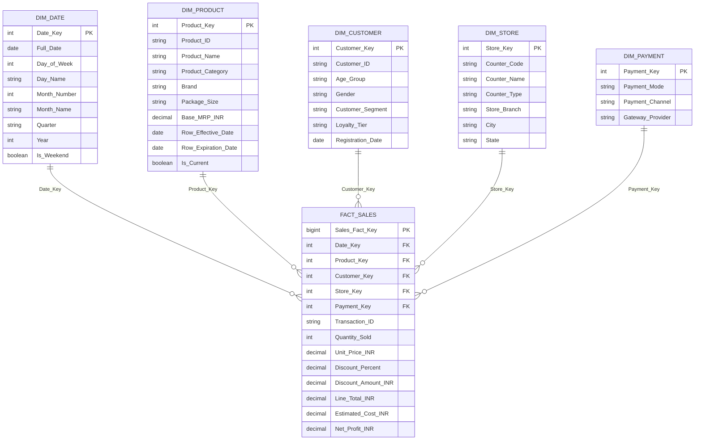

# Star Schema Design & Dimensional Modeling Specification

**Course**: Data Warehouse and Data Mining (Course Code: 4040233302)  
**Institution**: Silver Oak College of Computer Application  
**Department**: Department of Computer Application, BCA Semester 5th (A.Y. 2026-27)  
**Target Enterprise**: FreshMart Supermarket Point-of-Sale System  
**Deliverable**: Deliverable 4 (Star Schema Specification - 5 Marks Rubric)

---

## 1. Star Schema Architecture

The **Star Schema** is the premier dimensional design pattern in modern data warehousing. It features a central **Fact Table** containing quantified numerical measures, directly linked to completely denormalized **Dimension Tables** via surrogate foreign keys, forming a star-like topology.

---

## 2. Table Specifications & Schema Definitions

### 2.1 Central Fact Table: `Fact_Sales`
- **Grain**: One record per individual product line item on a retail checkout receipt.
- **Primary Key**: `Sales_Fact_Key` (Surrogate integer).
- **Foreign Keys**:
  - `Date_Key` $\rightarrow$ `Dim_Date.Date_Key`
  - `Product_Key` $\rightarrow$ `Dim_Product.Product_Key`
  - `Customer_Key` $\rightarrow$ `Dim_Customer.Customer_Key`
  - `Store_Key` $\rightarrow$ `Dim_Store.Store_Key`
  - `Payment_Key` $\rightarrow$ `Dim_Payment.Payment_Key`
- **Degenerate Dimension**: `Transaction_ID` (Retained on the fact table to enable market basket groupings without creating a redundant parent table).
- **Additive Measures**:
  - `Quantity_Sold` (Units count)
  - `Discount_Amount_INR` (₹)
  - `Line_Total_INR` (Net revenue collected in ₹)
  - `Estimated_Cost_INR` (Wholesale COGS in ₹)
  - `Net_Profit_INR` (Gross profit in ₹)

### 2.2 Conformed Dimension Tables

#### 1. `Dim_Date` (Temporal Conformation)
- Enables hierarchical slicing from calendar dates up to fiscal quarters and multi-year comparisons.
- Special flags like `Is_Weekend` facilitate immediate isolation of weekend shopping rushes.

#### 2. `Dim_Product` (Merchandising Conformation)
- Completely denormalized: stores product details, brands, package sizes, and high-level departments in a single table, eliminating expensive parent joins.
- Features SCD Type 2 audit columns (`Row_Effective_Date`, `Row_Expiration_Date`, `Is_Current`) to track retail price modifications accurately over time.

#### 3. `Dim_Customer` (Demographic Conformation)
- Connects demographic groups (`Age_Group`, `Gender`) and data mining output labels (`Customer_Segment`, `Loyalty_Tier`) directly to transactional behavior.

#### 4. `Dim_Store` (Spatial Conformation)
- Captures counter types (Express Counter, Regular Counter, Self-Checkout) and supermarket branch geography.

#### 5. `Dim_Payment` (Tender Conformation)
- Captures tender types (`UPI`, `Cash`, `Credit Card`, `Debit Card`) to evaluate transaction fees and payment adoption.

---

## 3. Comparative Architecture Analysis

To substantiate the architectural decision, the Star Schema was evaluated against alternative dimensional schemas:

| Evaluation Dimension | Star Schema (Selected) | Snowflake Schema | Fact Constellation Schema |
| :--- | :--- | :--- | :--- |
| **Normalization Level** | Denormalized dimension tables (1NF / 2NF) | Fully normalized dimension hierarchies (3NF) | Denormalized dimensions shared across multiple fact tables |
| **Join Complexity** | **Minimal (1-hop joins)**. Direct join between Fact and any Dimension. | **High (Multi-hop joins)**. Requires chaining through sub-dimensions (e.g. Item $\rightarrow$ Category $\rightarrow$ Department). | Moderate to high depending on which fact table is targeted. |
| **Query Performance** | **Optimal for OLAP & BI**. Maximizes index efficiency and query response speed. | Slower. Database engine must resolve complex multi-table joins. | High for complex enterprise processes, but increased initial setup overhead. |
| **Storage Consumption** | Slightly higher due to attribute duplication (negligible with modern disk costs). | Minimal. Eliminates redundant string attributes via sub-tables. | Moderate. Shared dimensions conserve disk space across business units. |
| **Maintenance Simplicity**| **Very Simple**. Intuitive for business analysts and reporting tools. | Complex. Updating an entity requires cascades through normalized tables. | High complexity. Changes must be coordinated across multiple business units. |
| **Suitability for Supermarket**| **Perfect Match**. High-speed POS reporting and simple SQL slicing. | Overkill for a supermarket chain; degrades query speeds unnecessarily. | Ideal when integrating Inventory, Sales, and Supplier Purchases together. |

### Rationale for Star Schema Selection:
1. **Blazing Fast Analytical Queries**: Slicing and dicing POS sales by Day, Category, and Payment requires only a single join per dimension.
2. **Intuitive Business Alignment**: Business executives and BI reporting tools can navigate the data model effortlessly without deep knowledge of database normalization rules.
3. **Optimized Aggregation**: Database optimizers take full advantage of Star Join algorithms and bitmap indexes on foreign keys.
